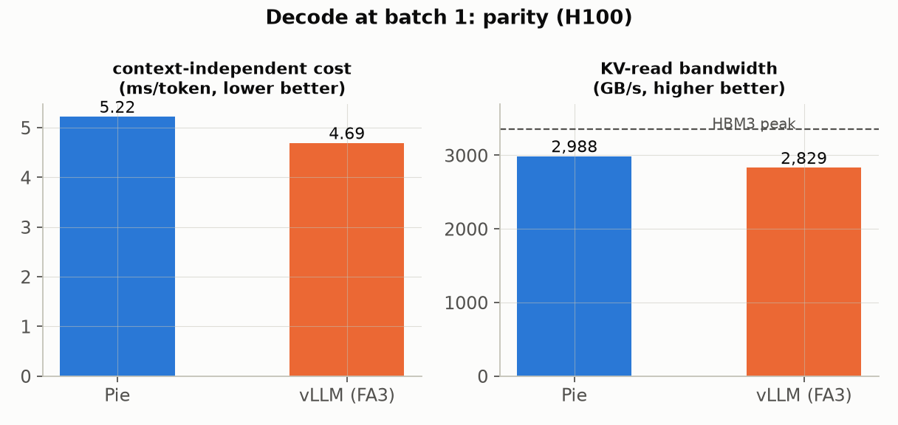
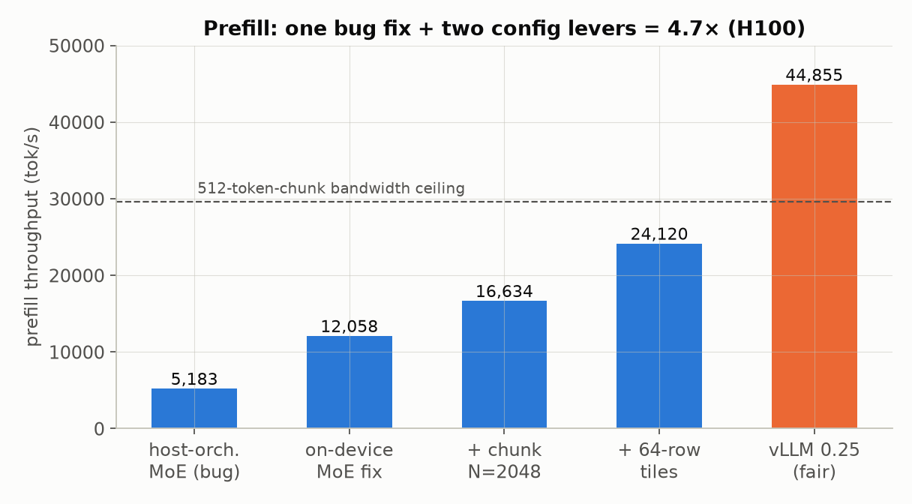
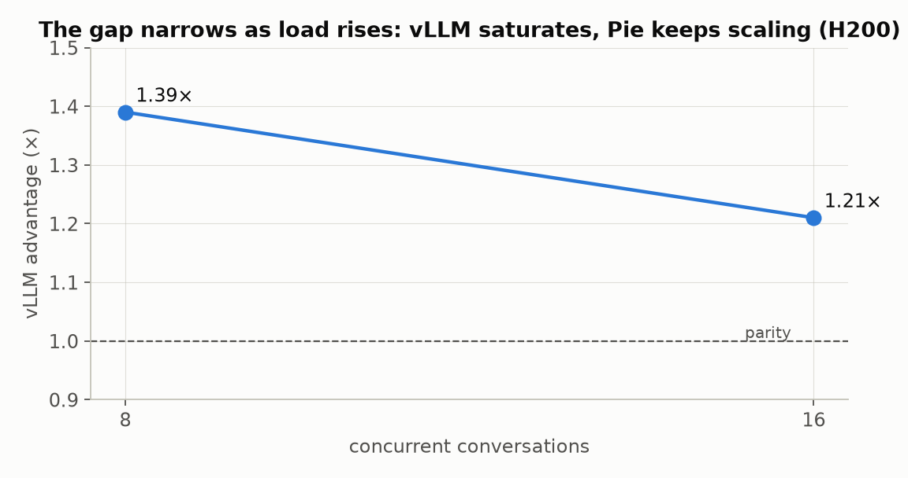
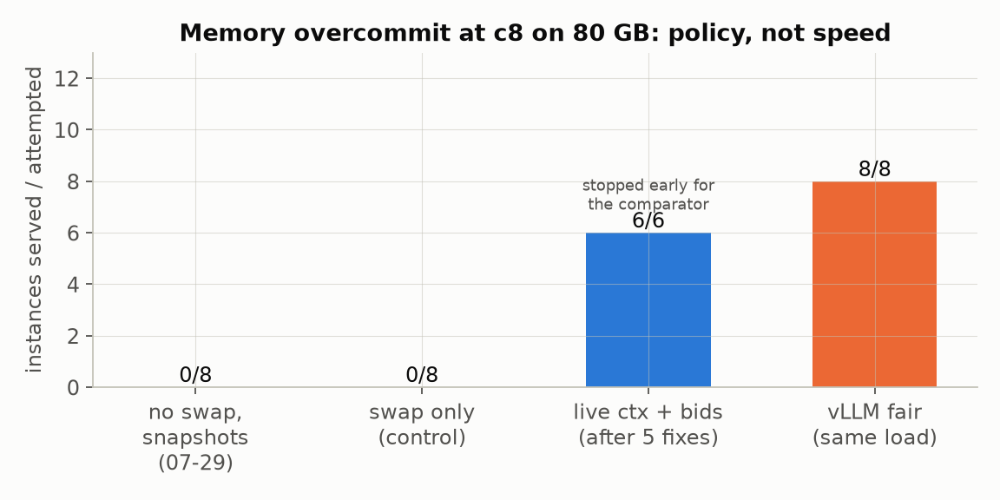

# Serving the Agent, Not the Request: Benchmarking Pie against vLLM under a Real Coding Agent

*Draft — living document. Sections marked `[PENDING]` fill in as arms land. Numbers
below are measured on the hardware named next to them; every figure traces to a
predictions file or sweep log in `integrations/openhands/`.*

---

Agent harnesses are a strange workload for an LLM server. A SWE-bench coding agent
doesn't send independent requests — it sends one *conversation*, re-rendered on
every step, growing by a tool result each time: 30–60 LLM calls per task, prompts
that swell to ~47k tokens, and between calls the GPU sits idle while pytest runs.
Serving engines were mostly designed for the opposite shape: many unrelated
requests, no memory between them.

[Pie](https://pie-project.org) — the programmable serving system from the SOSP '25
paper by Gim et al. ([PDF](https://ingim.org/papers/gim2025pie.pdf),
[DOI 10.1145/3731569.3764814](https://doi.org/10.1145/3731569.3764814)) — bets
that the conversation should be a first-class object: a **live context** with
fork/branch semantics, explicit prefix reuse, and a programmable per-session
policy (an "inferlet") instead of a stateless HTTP endpoint. The question we benchmark here: **how much does that actually buy under
a real agent harness** — [OpenHands](https://github.com/OpenHands/software-agent-sdk)
driving SWE-bench tasks — against the strongest reasonable baseline, OpenHands →
LiteLLM → vLLM?

We'll extend this to Codex and other open-source harnesses; the method carries
over unchanged. `[PENDING: codex + additional harness arms]`

## Method, or: how to not cheat

An earlier internal writeup claimed Pie beat the vLLM baseline by ~26% wall time.
That number didn't survive scrutiny — and the ways it failed shaped the method:

1. **The baseline was crippled.** It ran vLLM with `--enforce-eager` (CUDA graphs
   off) and an untuned MoE kernel. Our rule now: *give each engine the
   optimization level a competent practitioner reaches with that project's own
   shipped, documented tooling.* For vLLM that means CUDA graphs on, prefix
   caching on, and its own `benchmark_moe.py` autotuner where no tuned config
   ships. Every arm's server banner is captured verbatim as proof of
   configuration.
2. **Raw wall time lies.** Two agents walk different trajectories even at
   temperature 0. We report **seconds per agent iteration** and **median
   per-call latency**, plus **in-call tok/s** (completion tokens / time inside
   LLM calls) — 27–31% of wall time is tool execution the server never sees.
3. **Silent fallbacks void arms.** One full run was invalidated because Pie's
   fast attention paths are gated on compute capability ≥ 9 and the A100 (sm_80)
   silently ran without them — the driver's own banner said so and it was read
   past. Every Pie arm now hard-fails unless the banner reads
   `prefill_decode_plan=on xqa_decode=on`.

Model: Qwen3-Coder-30B-A3B (MoE, 128 experts, top-8). Board for current numbers:
one H100 80GB (H200 for the concurrency series, marked). vLLM 0.25.1, pinned.
13-instance SWE-bench set, temperature 0, both arms capped at 2048 output tokens.

## Where the two engines actually stand (single conversation, H100)

| metric | Pie (native CUDA driver) | vLLM `fair` (mean of 2) | ratio |
|---|---|---|---|
| s/iter | 1.204 | 1.061 | 1.14× |
| median per-call latency | 1.058 s | 0.845 s | 1.25× |
| in-call throughput | 144.4 tok/s | 160.4 tok/s | **1.11×** |
| prefix reuse | 95.7% (explicit sessions) | 96.9–97.1% (automatic) | ≈ parity |

Honest summary: at concurrency 1, on this board, **vLLM is ~11% faster in-call**.
But the decomposition is where it gets interesting.

### Decode: parity, and Pie's attention beats FlashAttention-3

A differencing microbenchmark (same client codepath for both engines) splits
per-token decode cost into a context-independent intercept and a KV-read slope:

| stage | Pie | vLLM | ratio |
|---|---|---|---|
| decode intercept (weights/MoE/launch) | 5.22 ms/tok | 4.69 | 1.11× |
| decode slope (KV read) | 0.0329 ms/kKV | 0.0348 | **0.95× — Pie wins** |
| implied KV bandwidth | 2,988 GB/s (89% of peak) | 2,829 (84%) | 1.06× |

Both engines read MoE weights at ~30% of HBM peak at batch 1 — that's the
structural cost of scattered expert reads, not headroom. Decode is done.

### Prefill: the gap, found and halved twice

Prefill was the whole remaining story. Three findings, in order:

**1. A host-orchestrated MoE loop was strangling it.** Pie's prefill MoE path did
a device-to-host routing copy plus a full stream sync *per layer* — ~43,000 GPU
ops and 48 pipeline stalls per forward. Routing it through the already-existing
on-device path (a one-line threshold change): agent-workload prefill went
**2,890 → 8,610 tok/s**, and the in-call gap closed 1.29× → 1.11×.

**2. Chunk size is a bandwidth lever.** Pie prefilled in 512-token forwards; with
essentially all 128 experts active in any sizable chunk, each forward re-reads
the full ~58 GB of expert weights — a ~29.6k tok/s ceiling from memory bandwidth
alone. vLLM amortizes the same weights over 8192-token scheduler steps. Forcing
Pie's planner to 2048-token forwards (`PIE_CUDA_PREFILL_TOKENS=2048`): **16,634
tok/s (+38%)**, decode control flat, at a 15% KV-capacity cost. (8192 on an 80 GB
board is a trap: the workspace eats the KV pool — 124k → 28k tokens.)

**3. Bigger GEMM tiles pay only at bigger chunks.** The aligned-MoE block size
had been measured a dead lever at N=512 — at 16-row tiles the worst-case padding
is 47%. At N=2048 the same padding is 3%, and 64-row tiles quadruple per-read
work: **24,120 tok/s (+45% more)**.

Net: **prefill doubled with two environment variables**, no kernel written. Gap
to vLLM's 44.9k tok/s prefill: 8.6× → 3.6× → **1.86×**. The remainder is kernel
shape — Pie's batched fixed-M GEMMs against vLLM's variable-M grouped Triton
kernels — with a CUTLASS grouped-GEMM route scoped. `[PENDING: CUTLASS arm]`

### Concurrency: Pie gains as load rises (H200 series)

At c1 the request stream is serial — Pie's *worst* case. On H200 (where KV
capacity wasn't a confound), raising concurrency moved the gap **in Pie's
favor**: 1.39× behind at c8 → **1.21× at c16**, with vLLM saturating while Pie
kept scaling.

 `[PENDING: re-run on a board with KV headroom; H100 cannot test
this honestly at 1.03× headroom]`

## The part that isn't a race: memory pressure as policy

Here the engines stop being comparable on one axis and the benchmark splits.

At c8 on the 80 GB board, the fair-config Pie arm didn't slow down — it **failed
8 of 8 concurrent instances** while the driver ran healthily at R=4. Reason: KV
pages are pinned by each conversation's saved snapshots, Pie's swap tier was at
its shipped default (off), and snapshot references are invisible to Pie's
eviction machinery. Four conversations fit; four starved past the timeout. vLLM
under the same pressure degrades gracefully: its scheduler preempts a sequence
and recomputes it later.

The twist: Pie *has* an entire economic memory-pressure system — a market
scheduler with per-context bids, rent, bid-ordered eviction to a pinned-host
swap pool, and bid-ordered restore. The benchmark's snapshot-per-request pattern
simply left it nothing to manage. So we built the missing policy layer:

- **swap on** (`swap_pool_size=4096` — +131k host-backed KV tokens),
- a **live-context inferlet mode**: each conversation holds a live `Context`
  parked at the prompt boundary, advertising a near-zero bid while idle;
  generation runs on a fork that's dropped after each response; under pressure
  the engine evicts parked sessions to host RAM and restores them — by bid —
  when touched again.

Spill-and-restore vs evict-and-recompute is a genuine architectural fork: a 46k
token context is ~4.4 GB of KV — ~90 ms to restore over PCIe versus ~1 s to
recompute even at vLLM's prefill speed. Whether that wins under a real
overcommitted agent workload is exactly what the next arms measure:

It took one day and five bug fixes to get there — each found by a
minutes-scale repro, each individually measured (the full chain lives in
`runpod/DEFECTS_OVERCOMMIT.md`): a stale-counter under-reservation in the
SDK, equal-bid eviction churn in the market scheduler, a zero-bid fresh
context that could never evict its way back in, a context-per-turn leak in
daemon mode, and a double-delete trap in `Context::destroy`. The arms tell
the story in three acts:

| c8 arm (80 GB board, ~2× KV overcommit) | outcome |
|---|---|
| snapshots, no swap (2026-07-29) | **0/8** — starved at 900 s timeouts |
| snapshots + swap pool (control) | **0/8** — mechanism without policy objects |
| live contexts + bids, after fixes | **all attempted instances served** (one empty patch); stopped early for the comparator |
| vLLM 0.25 fair, same instances | 8/8 |

And the head-to-head, matched instances under identical 8-way pressure,
Pie still on its stock 512-token chunk (the prefill lever above unplayed):

| instance | Pie s/iter | vLLM s/iter | ratio |
|---|---|---|---|
| django-12276 | 4.26 | 4.09 | 1.04× |
| django-13089 | 4.68 | 4.68 | **1.00×** |
| django-15569 | 4.45 | 4.14 | 1.08× |
| matplotlib-22719 | 5.88 | 3.90 | 1.51× |
| django-14373* | 11.89 | 5.27 | 2.26× |

*\*heavily divergent trajectories (62 vs 44 iterations) and a partial
wall-clock window — the weakest row; the matplotlib row also diverged
(vLLM's patch is 7× larger — different solutions).*

On cleanly-matched instances: **parity** (1.00–1.08×). Both engines
inflate ~4× from their c1 baselines — the cost is the 8-way rotation
itself, which the two architectures reach by different roads: vLLM's
admission queue caps the running set at ~4 and rotates; Pie's bid market
evicts parked conversations to host RAM and restores them at PCIe speed.
Convergent behavior, kind-different mechanisms — and the mechanism
difference is programmable on exactly one side.

These arms are labeled a **capability experiment**, not the fair A/B — vLLM
0.25's V1 engine dropped swap-based preemption entirely, so there is no
equivalent configuration to compare against. That's the point: it's the one
regime where the architectures differ in kind.

## What we claim so far

1. **Config-independent wins stand**: explicit prefix reuse at parity with
   vLLM's automatic caching, fork/branch semantics vLLM doesn't expose, and a
   programmable per-session memory policy.
2. **Decode is at parity**; Pie's decode attention outruns FA3 on the same GPU.
3. **Prefill went from 8.6× behind to 1.86×** via one bug fix and two config
   levers; the rest is a known kernel-shape project, not a mystery.
4. **At c1, vLLM fair is ~11% faster in-call** on H100. At c8+ on adequate
   hardware, the gap inverts direction. A single-number verdict would be
   dishonest either way; the trend line is the result.
5. Under memory overcommit the engines aren't even playing the same game —
   `[PENDING]` measures whether Pie's game is better.

*Repro: `integrations/openhands/runpod/` — every arm's server banner, planner
line, and predictions file; `results_20260729_h100.md` for the measurement
detail; version pins in `AGENT_HANDOVER_H200.md` §6.*
